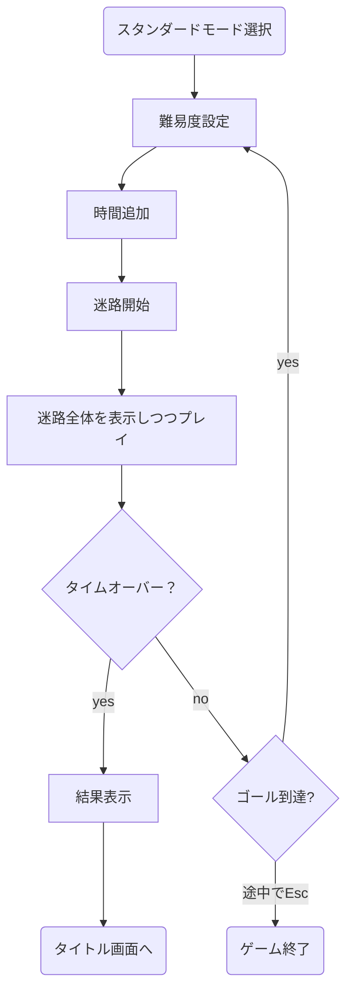

```mermaid
flowchart TD

E(スタンダードモード選択) --> E0[難易度設定]
E0 --> E1[時間追加]
E1 --> E2[迷路開始]
E2 --> E3[迷路全体を表示しつつプレイ]
E3 --> E6{タイムオーバー？}
E6 --> |yes|E7[結果表示]
E7 --> E5(タイトル画面へ)
E6 --> |no|E4{ゴール到達?}
E4 -->|yes| E0
E4 -->|途中でEsc| X(ゲーム終了)
```
