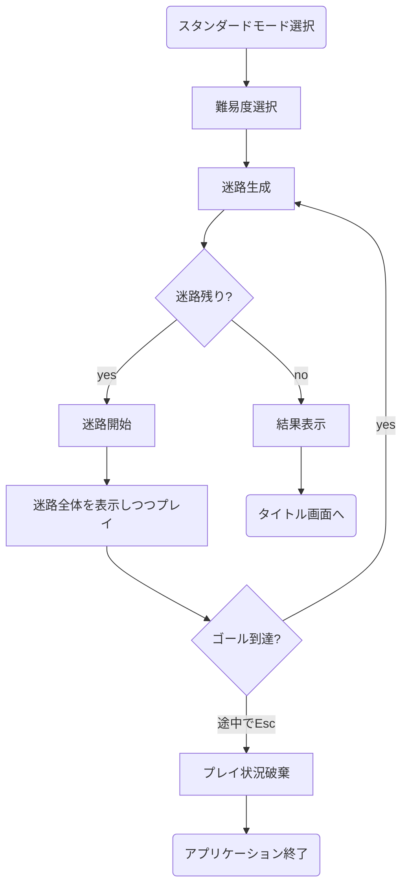

```mermaid
flowchart TD

A(スタンダードモード選択) --> D1[難易度選択]
D1 --> D2[迷路生成]
D2 --> D3{迷路残り?}
D3 -->|yes| D4[迷路開始]
D4 --> D5[迷路全体を表示しつつプレイ]
D5 --> D6{ゴール到達?}
D6 -->|yes| D2
D6 -->|途中でEsc| X[プレイ状況破棄]
X --> X2(アプリケーション終了)
D3 -->|no| D7[結果表示]
D7 --> B(タイトル画面へ)
```
