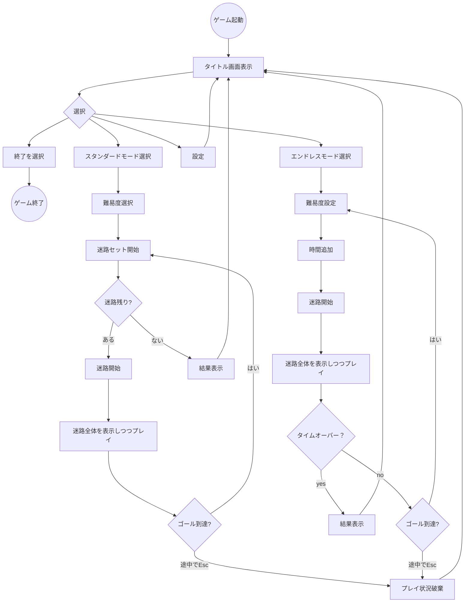

# 設計図メモ

## フローチャート

```mermaid
flowchart TD

    %% === 起動 ===
    A((ゲーム起動)) --> B[タイトル画面表示]

    %% === タイトル画面 ===
    B --> C{選択}
    C --> D[スタンダードモード選択]
    C --> E[エンドレスモード選択]
    C --> F[設定]
    C --> G[終了を選択]

    %% === 設定 ===
    F --> B

    %% === 終了 ===
    G --> Z((ゲーム終了))

    %% === スタンダードモード ===
    D --> D1[難易度選択]
    D1 --> D2[迷路セット開始]
    D2 --> D3{迷路残り?}
    D3 -->|ある| D4[迷路開始]
    D4 --> D5[迷路全体を表示しつつプレイ]
    D5 --> D6{ゴール到達?}
    D6 -->|はい| D2
    D6 -->|途中でEsc| X[プレイ状況破棄]
    D3 -->|ない| D7[結果表示]
    D7 --> B

    %% === エンドレスモード ===
    E --> E1[難易度設定]
    E1 --> E5[時間追加]
    E5 --> E2[迷路開始]
    E2 --> E3[迷路全体を表示しつつプレイ]
    E3 --> E6{タイムオーバー？}
    E6 --> |yes|E7[結果表示]
    E7 --> B
    E6 --> |no|E4{ゴール到達?}
    E4 -->|はい| E1
    E4 -->|途中でEsc| X

    %% === Escで終了処理 ===
    X --> B
```
