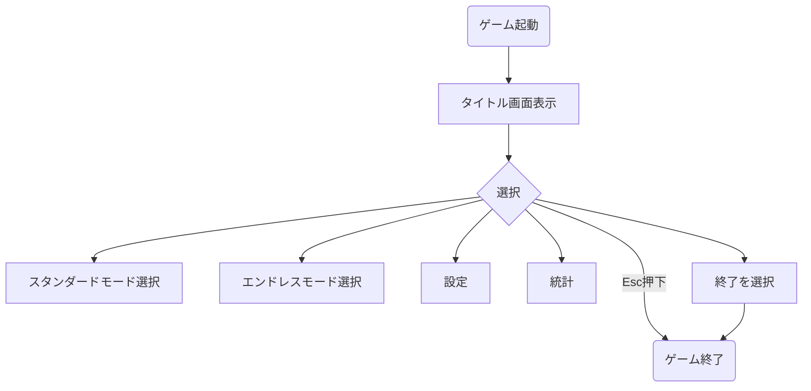

```mermaid
flowchart TD

    %% === 起動 ===
    A(ゲーム起動) --> B[タイトル画面表示]

    %% === タイトル画面 ===
    B --> C{選択}
    C --> D[スタンダードモード選択]
    C --> E[エンドレスモード選択]
    C --> F[設定]
    C --> H[統計]
    C --> G[終了を選択]
    C --> |Esc押下|Z

    %% === 終了 ===
    G --> Z(ゲーム終了)
```
